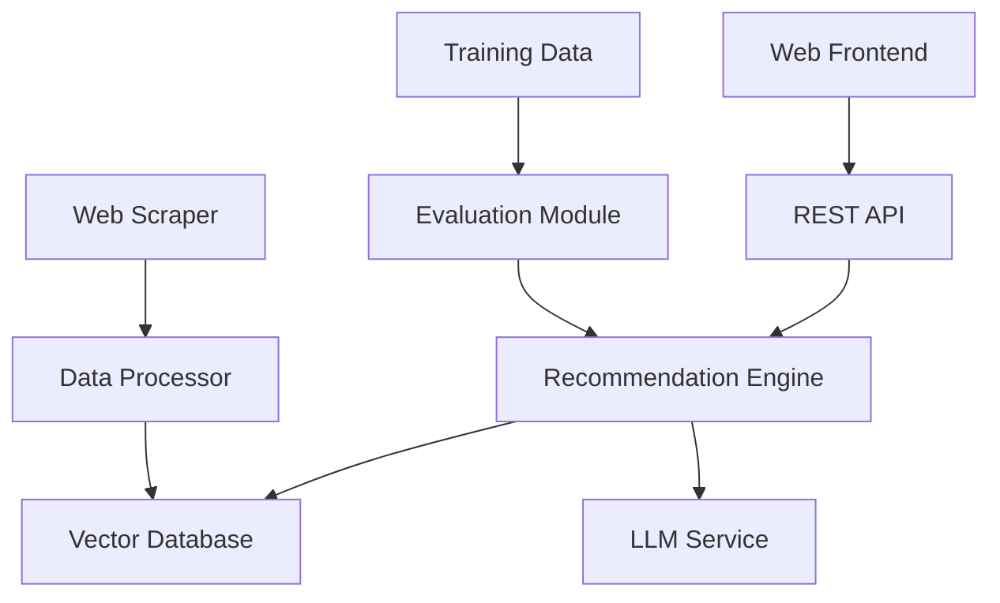

# SHL Assessment Recommendation System - Design Document

## Overview

The SHL Assessment Recommendation System is an intelligent web application that helps hiring managers and recruiters find relevant SHL assessments based on natural language queries or job descriptions. The system leverages modern LLM-based techniques, web scraping, vector embeddings, and retrieval-augmented generation to provide accurate and balanced assessment recommendations.

## Architecture

### High-Level Architecture



### System Components

1. **Web Scraper**: Extracts assessment data from SHL's product catalog
2. **Data Processor**: Cleans, structures, and prepares assessment data
3. **Vector Database**: Stores embeddings for efficient similarity search
4. **LLM Service**: Processes queries and generates contextual understanding
5. **Recommendation Engine**: Core logic for matching queries to assessments
6. **REST API**: Provides programmatic access to recommendations
7. **Web Frontend**: User interface for testing and demonstration
8. **Evaluation Module**: Measures system performance using provided datasets

## Components and Interfaces

### 1. Web Scraper Module

**Purpose**: Extract assessment data from SHL's product catalog

**Key Classes**:
- `SHLCatalogScraper`: Main scraper class
- `AssessmentParser`: Parses individual assessment pages
- `DataValidator`: Validates scraped data quality

**Interfaces**:
```python
class SHLCatalogScraper:
    def scrape_catalog(self) -> List[Assessment]
    def get_individual_tests(self) -> List[Assessment]
    def validate_minimum_count(self, assessments: List[Assessment]) -> bool
```

**Data Flow**:
1. Navigate to SHL product catalog
2. Filter for "Individual Test Solutions" only
3. Extract assessment details (name, URL, category, test type, description)
4. Validate minimum 377 assessments collected
5. Store structured data for processing

### 2. Data Processing Pipeline

**Purpose**: Transform raw scraped data into searchable format

**Key Classes**:
- `AssessmentProcessor`: Main processing logic
- `EmbeddingGenerator`: Creates vector embeddings
- `CategoryMapper`: Maps assessments to skill domains

**Interfaces**:
```python
class AssessmentProcessor:
    def process_assessments(self, raw_data: List[Dict]) -> List[Assessment]
    def generate_embeddings(self, assessments: List[Assessment]) -> np.ndarray
    def create_search_index(self, embeddings: np.ndarray) -> VectorIndex
```

**Processing Steps**:
1. Clean and normalize assessment text
2. Extract key features (test type, skills, domains)
3. Generate embeddings using sentence transformers
4. Create vector index for similarity search
5. Store processed data in vector database

### 3. LLM-Based Recommendation Engine

**Purpose**: Core intelligence for matching queries to relevant assessments

**Key Classes**:
- `RecommendationEngine`: Main recommendation logic
- `QueryProcessor`: Processes and understands user queries
- `BalancedRanker`: Ensures balanced recommendations across domains

**Interfaces**:
```python
class RecommendationEngine:
    def recommend(self, query: str, max_results: int = 10) -> List[Recommendation]
    def process_query(self, query: str) -> QueryEmbedding
    def rank_assessments(self, query_embedding: QueryEmbedding) -> List[ScoredAssessment]
    def balance_recommendations(self, scored_assessments: List[ScoredAssessment]) -> List[Recommendation]
```

**Recommendation Algorithm**:
1. **Query Understanding**: Use LLM to extract key skills, roles, and requirements
2. **Embedding Generation**: Create query embedding using same model as assessments
3. **Similarity Search**: Find top-K similar assessments using cosine similarity
4. **Domain Balancing**: Ensure mix of technical (Type K) and behavioral (Type P) assessments
5. **Ranking & Filtering**: Apply business rules and return top 1-10 results

### 4. Vector Database Integration

**Purpose**: Efficient storage and retrieval of assessment embeddings

**Technology Choice**: FAISS (Facebook AI Similarity Search) or Chroma
- Fast similarity search capabilities
- Support for different distance metrics
- Scalable to large assessment catalogs

**Schema**:
```python
class AssessmentVector:
    id: str
    name: str
    url: str
    category: str
    test_type: str  # K (Knowledge & Skills) or P (Personality & Behavior)
    embedding: np.ndarray
    metadata: Dict[str, Any]
```

### 5. REST API Layer

**Purpose**: Provide programmatic access to recommendation system

**Framework**: FastAPI for automatic documentation and validation

**Endpoints**:

```python
# Health Check Endpoint
@app.get("/health")
async def health_check() -> HealthResponse:
    return {
        "status": "healthy",
        "uptime": get_uptime(),
        "version": "1.0.0",
        "assessments_loaded": get_assessment_count()
    }

# Recommendation Endpoint
@app.post("/recommend")
async def get_recommendations(request: RecommendationRequest) -> RecommendationResponse:
    return {
        "query": request.query,
        "recommendations": [
            {
                "assessment_name": assessment.name,
                "url": assessment.url,
                "relevance_score": assessment.score,
                "test_type": assessment.test_type
            }
            for assessment in recommendations
        ],
        "total_results": len(recommendations)
    }
```

### 6. Web Frontend Application

**Purpose**: User-friendly interface for testing recommendations

**Technology Stack**:
- **Frontend**: React.js with TypeScript
- **Styling**: Tailwind CSS for responsive design
- **State Management**: React hooks for simple state management

**Key Components**:
- `QueryInput`: Text area for job descriptions/queries
- `RecommendationTable`: Displays results in tabular format
- `LoadingSpinner`: Shows processing status
- `ErrorBoundary`: Handles and displays errors gracefully

**User Flow**:
1. User enters job description or query
2. Frontend sends request to /recommend API
3. Results displayed in table with assessment names and URLs
4. Users can click URLs to view assessments on SHL site

### 7. Evaluation and Optimization Module

**Purpose**: Measure and improve system performance

**Key Classes**:
- `EvaluationEngine`: Runs evaluation metrics
- `PerformanceOptimizer`: Iterates on system improvements
- `MetricsCalculator`: Computes Mean Recall@K

**Evaluation Process**:
1. **Training Data Evaluation**: Use 10 labeled queries for development
2. **Hyperparameter Tuning**: Optimize embedding models, similarity thresholds
3. **Prompt Engineering**: Refine LLM prompts for better query understanding
4. **Balance Optimization**: Tune domain balancing algorithms
5. **Test Set Prediction**: Generate final predictions for 9 test queries

## Data Models

### Core Data Structures

```python
@dataclass
class Assessment:
    id: str
    name: str
    url: str
    category: str
    test_type: str  # 'K' for Knowledge & Skills, 'P' for Personality & Behavior
    description: str
    skills: List[str]
    embedding: Optional[np.ndarray] = None

@dataclass
class Query:
    text: str
    extracted_skills: List[str]
    job_role: str
    embedding: np.ndarray

@dataclass
class Recommendation:
    assessment: Assessment
    relevance_score: float
    explanation: str

@dataclass
class EvaluationResult:
    query: str
    predicted_assessments: List[str]
    actual_assessments: List[str]
    recall_at_k: float
```

### Database Schema

**Assessments Table**:
```sql
CREATE TABLE assessments (
    id VARCHAR PRIMARY KEY,
    name VARCHAR NOT NULL,
    url VARCHAR NOT NULL,
    category VARCHAR,
    test_type CHAR(1),
    description TEXT,
    skills JSON,
    embedding BLOB,
    created_at TIMESTAMP,
    updated_at TIMESTAMP
);
```

## Error Handling

### Error Categories and Responses

1. **Scraping Errors**:
   - Network timeouts: Retry with exponential backoff
   - Missing data: Log warnings, continue with available data
   - Rate limiting: Implement delays and respect robots.txt

2. **API Errors**:
   - Invalid queries: Return 400 with helpful error message
   - Service unavailable: Return 503 with retry information
   - Internal errors: Return 500 with generic message, log details

3. **Recommendation Errors**:
   - No results found: Return empty list with explanation
   - Embedding failures: Fallback to keyword-based search
   - LLM service down: Use cached embeddings only

### Error Response Format

```python
@dataclass
class ErrorResponse:
    error_code: str
    message: str
    details: Optional[Dict[str, Any]] = None
    timestamp: str = field(default_factory=lambda: datetime.utcnow().isoformat())
```

## Testing Strategy

### Unit Testing
- **Coverage Target**: 90%+ code coverage
- **Key Areas**: Data processing, recommendation logic, API endpoints
- **Tools**: pytest, unittest.mock for external service mocking

### Integration Testing
- **API Testing**: Test all endpoints with various input scenarios
- **Database Testing**: Verify data persistence and retrieval
- **LLM Integration**: Test with mock and real LLM responses

### Performance Testing
- **Load Testing**: API performance under concurrent requests
- **Latency Testing**: Response times for recommendation generation
- **Scalability Testing**: System behavior with large assessment catalogs

### Evaluation Testing
- **Accuracy Testing**: Mean Recall@K on training data
- **Balance Testing**: Verify domain distribution in recommendations
- **Edge Case Testing**: Handle unusual queries, empty results, malformed input

## Deployment Architecture

### Cloud Infrastructure

**Platform**: Google Cloud Platform (free tier)
- **Compute**: Cloud Run for containerized API
- **Storage**: Cloud Storage for assessment data and models
- **Database**: Cloud SQL (PostgreSQL) for structured data
- **Vector Search**: Vertex AI Vector Search or self-hosted FAISS

### Container Strategy

**Docker Configuration**:
```dockerfile
FROM python:3.11-slim

WORKDIR /app
COPY requirements.txt .
RUN pip install -r requirements.txt

COPY . .
EXPOSE 8000

CMD ["uvicorn", "main:app", "--host", "0.0.0.0", "--port", "8000"]
```

### CI/CD Pipeline

**GitHub Actions Workflow**:
1. **Code Quality**: Linting, type checking, security scanning
2. **Testing**: Unit tests, integration tests, evaluation metrics
3. **Build**: Docker image creation and registry push
4. **Deploy**: Automated deployment to Cloud Run
5. **Monitoring**: Health checks and performance monitoring

### Environment Configuration

**Development Environment**:
- Local development with Docker Compose
- Mock LLM services for faster iteration
- Subset of assessment data for testing

**Production Environment**:
- Fully containerized deployment
- Real LLM API integration
- Complete assessment catalog
- Monitoring and logging enabled

## Security Considerations

### Data Protection
- **API Security**: Rate limiting, input validation, CORS configuration
- **Data Privacy**: No storage of user queries beyond session
- **Access Control**: API key authentication for production use

### LLM Security
- **Prompt Injection**: Input sanitization and validation
- **Content Filtering**: Ensure appropriate responses only
- **API Key Management**: Secure storage of LLM service credentials

## Performance Optimization

### Caching Strategy
- **Assessment Embeddings**: Cache in memory for fast access
- **Query Results**: Cache frequent queries with TTL
- **LLM Responses**: Cache processed query understanding

### Scalability Considerations
- **Horizontal Scaling**: Stateless API design for multiple instances
- **Database Optimization**: Indexed searches, connection pooling
- **CDN Integration**: Static assets served via CDN

### Monitoring and Metrics
- **Application Metrics**: Response times, error rates, throughput
- **Business Metrics**: Recommendation accuracy, user satisfaction
- **Infrastructure Metrics**: CPU, memory, network usage

This design provides a comprehensive foundation for building the SHL Assessment Recommendation System while ensuring scalability, maintainability, and high performance.